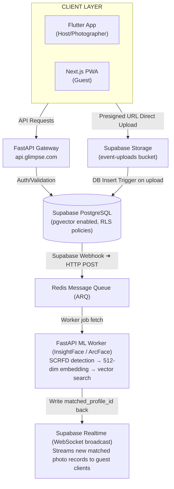

# Glimpse — Product Requirements Document

**Project:** Glimpse
**Status:** Active Development — Sprint 1
**Version:** 2.0.0
**Last Updated:** June 2026
**Target Launch:** September 2026 (3-Month Sprint)

---

## Table of Contents

1. [Executive Summary & Vision](#1-executive-summary--vision)
2. [The Problem We're Solving](#2-the-problem-were-solving)
3. [The Hybrid Innovation](#3-the-hybrid-innovation)
4. [User Personas & Core Journeys](#4-user-personas--core-journeys)
5. [Application Structure & Codebase Overview](#5-application-structure--codebase-overview)
6. [Mobile App Design](#6-mobile-app-design)
7. [Technical System Architecture](#7-technical-system-architecture)
8. [Database Schema Specification](#8-database-schema-specification)
9. [Machine Learning & Face Matching Specifications](#9-machine-learning--face-matching-specifications)
10. [Functional Requirements by Epic](#10-functional-requirements-by-epic)
11. [Screen-by-Screen Specification](#11-screen-by-screen-specification)
12. [Non-Functional Requirements](#12-non-functional-requirements)
13. [Privacy, Consent & Safety Rules](#13-privacy-consent--safety-rules)
14. [Design System Reference](#14-design-system-reference)
15. [3-Month Build Roadmap](#15-3-month-build-roadmap)
16. [Key Performance Indicators](#16-key-performance-indicators)
17. [Risk Register & Mitigation](#17-risk-register--mitigation)
18. [Open Questions & Decisions](#18-open-questions--decisions)

---

## 1. Executive Summary & Vision

Glimpse is an AI-powered event photography ecosystem that eliminates the friction of finding yourself in hundreds of unorganized post-event photo dumps. Every major event — a wedding, a corporate summit, a university graduation, a birthday party — ends the same way: the photographer shares a Dropbox link containing 600 images, and guests spend 40 minutes scrolling through strangers' faces to find 3 photos of themselves.

Glimpse ends this entirely.

By combining a real-time facial recognition pipeline with a gamified candid camera mechanic, Glimpse delivers a private, personalized gallery directly to every guest's device — automatically, while the event is still happening. A guest scans a QR code, takes a 10-second onboarding selfie, and from that moment on, every professional photo that features their face appears on their private screen within seconds of the shutter click.

The product is not just a media delivery tool. It is a new category: **automated event memory personalization**.

---

## 2. The Problem We're Solving

### For Guests
- No way to easily find photos of themselves in large shared albums.
- Privacy discomfort: full-event photo dumps expose every attendee's images to every other attendee.
- No mechanism to contribute candid, authentic moments — only the photographer's curated perspective gets preserved.

### For Hosts
- Logistics overhead: organizing and distributing professional photos after an event takes days.
- No visibility into whether guests are engaging with photography at all.
- No way to enforce creative constraints (photo counts, styles) across hundreds of attendees.

### For Photographers
- No feedback loop during an event to know if their shots are working.
- Delivery is a manual, time-consuming afterthought.
- No native system for managing multi-photographer teams at a single event.

---

## 3. The Hybrid Innovation

Glimpse is built on two distinct but complementary mechanics that together create the full product experience.

### 3.1 — The Core Glimpse Engine (Centralized AI Curator)

The primary innovation. A real-time AI pipeline that ingests professional photographer uploads, detects every face in every photo, and matches each face against a registered guest's onboarding selfie using cosine similarity on 512-dimensional ArcFace embeddings. When a match is confirmed, the photo is pushed instantly to that guest's private gallery via Supabase Realtime WebSockets — no manual sorting, no search, no waiting.

**Mechanic summary:**
```
Photographer uploads batch → Supabase Storage trigger → Redis job queue →
FastAPI/InsightFace worker → Vector similarity search → Profile match →
Realtime push to guest device
```

### 3.2 — The Glimpse Social Lens (Decentralized Candid Camera)

The social layer that makes Glimpse a participatory experience, not just a passive delivery service. Inspired by the single-use disposable camera concept (as seen in products like *Once*), guests are given a fixed, host-controlled allocation of shots within the app's built-in camera. Film-grain presets give every photo a nostalgic, cinematic quality.

The critical magic: **if a guest takes a photo of another guest, the AI identifies the subject and delivers that candid photo to the subject's gallery automatically** — with attribution (e.g., "A candid moment captured by Maya").

**Mechanic summary:**
```
Guest fires shutter → Candid uploaded with guest attribution →
Same ML pipeline runs → Subject identified → Photo appears in subject's gallery
```

This closes the loop: guests aren't just passive recipients. They become photographers for each other.

---

## 4. User Personas & Core Journeys

### 4.1 — The Host

**Persona:** Event planner, couple getting married, corporate event coordinator, university organization lead, birthday party host.

**Core Pain:** Coordinating photography logistics across vendors, guests, and post-event delivery is stressful and time-consuming.

**Journey:**

1. Downloads Glimpse mobile app and authenticates via Email or OAuth.
2. Selects **"I'm a Host"** from the role selection screen.
3. Creates a new event through a 3-step wizard:
   - Step 1: Event name, date, and description.
   - Step 2: Guest count estimate and per-guest photo limit (default: 15 shots).
   - Step 3: Branding/styling parameters and event theme.
4. The app generates two gateway assets:
   - **Photographer Invite Link** — a deep link distributed to the professional photography crew.
   - **Event QR Code** — a printable/displayable code for guest onboarding at the venue.
5. Monitors live event analytics: number of registered guests, photos ingested, match rate, active guests.
6. After the event, accesses the **Album Archive** screen to review all captured media organized by source (studio vs. candid) and export options.

**Key screens:** Role Selection → Host Welcome → Event Creation → Event Launch → Album Archive → Invite Photographers

---

### 4.2 — The Photographer

**Persona:** Freelance event photographer, agency-employed professional shooter, second-shooter on a photography team.

**Core Pain:** Post-event photo delivery is a bottleneck. Clients and guests want photos immediately; editing and uploading takes days.

**Journey:**

1. Receives the Photographer Invite Link from the host.
2. Clicks link, downloads the app (or opens the web dashboard), and authenticates.
3. Their account is automatically linked to the specific Event ID from the invite link.
4. During or immediately after the event, bulk uploads raw or high-resolution JPG/PNG files directly from their camera roll or memory card.
5. Monitors live ingestion status on the **Photographer Dashboard**: photos uploaded, faces detected, successful guest matches, and processing queue status.
6. Receives real-time confirmation as batches are processed and matched to guests.

**Key screens:** Photographer Welcome → Photographer Dashboard

---

### 4.3 — The Guest

**Persona:** Event attendee — wedding guest, conference attendee, party guest, graduation attendee. Any age. May not be technically proficient.

**Core Pain:** Can never find photos of themselves without spending significant time searching. Wants to relive memories without effort.

**Journey:**

1. Spots the Event QR code at the venue on a table card, screen, or printed sign.
2. Scans the QR code with their phone camera. **No App Store download required.** The experience opens directly in their mobile browser via the Next.js PWA, or optionally via an App Clip on iOS.
3. The **Event Landing Screen** confirms the event they've joined.
4. The **Guest Name Screen** captures their display name.
5. The **Face Scan Screen** presents an animated selfie capture UI — a 2.4-second scanning animation with a sweep effect confirms the scan is complete.
6. The **Face Verification Screen** previews their captured selfie for confirmation before submission.
7. The **Matching Animation Screen** plays while the ML pipeline processes their registration selfie and generates their identity embedding.
8. On success, the **Instant Reveal Screen** shows the first matched photos already in their gallery (if the event is underway).
9. The guest lands on **Guest Hub** — their private, persistent gallery — which displays:
   - **Studio Portfolio** tab: Professional photographer matches, appearing in real time as new photos are processed.
   - **Candid Lens** tab: The built-in camera with film presets and a shot counter.
10. Any time they return to the QR code link, their session is restored automatically.
11. A persistent **"Purge My Data"** option is visible at all times.

**Key screens:** Guest Entry → QR Scanner → Event Landing → Guest Name → Guest Setup → Face Scan → Face Verification → Matching Animation → Instant Reveal → Guest Hub → Viewfinder → Share

---

## 5. Application Structure & Codebase Overview

The repository (`glimpse-main`) follows a monorepo structure with clearly separated layers:

```
glimpse-main/
├── mobile/                    # Flutter mobile app (Host, Photographer, Guest)
│   ├── lib/
│   │   ├── core/
│   │   │   ├── navigation/    # go_router configuration (all 25+ routes)
│   │   │   ├── theme/         # GlimpseColors, GlimpseTheme (light/dark)
│   │   │   ├── state/         # Riverpod providers
│   │   │   ├── utils/         # Responsive sizing utilities
│   │   │   └── widgets/       # Shared UI components (GlimpseInput)
│   │   └── features/
│   │       ├── auth/          # AuthScreen, SignupScreen, ForgotPasswordScreen
│   │       ├── guest/         # All 12 guest-facing screens
│   │       ├── host/          # All 8 host/photographer screens
│   │       └── shared/        # SplashScreen, ShareScreen, shared widgets
├── frontend/                  # Next.js web app (guest PWA — scaffolded)
├── frontend-old/              # Previous Next.js iteration (reference only)
├── api/                       # FastAPI API gateway (scaffolded)
├── processing/                # FastAPI ML Worker / InsightFace pipeline (scaffolded)
├── supabase/
│   └── migrations/
│       └── 0000_initial_schema.sql   # pgvector schema
└── docker-compose.yml         # Local dev: pgvector + Redis
```

### Current Build State

| Layer | Status | Notes |
|---|---|---|
| Flutter mobile | 🟡 UI Complete | All screens built, navigation wired, no backend integration yet |
| Next.js frontend | 🔴 Scaffolded | Empty `package.json`, build not started |
| FastAPI gateway | 🔴 Scaffolded | Empty `package.json` placeholder, not yet Python |
| FastAPI ML worker | 🔴 Scaffolded | Empty placeholder, InsightFace not yet wired |
| Supabase schema | 🟢 Defined | Migration SQL ready, not yet applied to hosted project |
| Docker Compose | 🟢 Ready | `pgvector` + Redis configured for local dev |

**Critical note:** The `frontend/` and `api/` directories contain Node.js `package.json` stubs, not Python projects. These need to be replaced with proper FastAPI (Python) project structures for the API gateway and ML worker layers.

### Mobile Tech Stack

| Concern | Choice |
|---|---|
| Framework | Flutter (Dart SDK ≥3.1.0) |
| State Management | Riverpod 3.3.1 (`flutter_riverpod`) |
| Navigation | go_router 17.2.3 |
| Icons | phosphor_flutter (pinned to git `main`) |
| Typography | EB Garamond (display), Geist (UI) — loaded as local assets |
| Theming | Dark-first (`ThemeMode.dark`), `GlimpseColors` constants |

---

## 6. Mobile App Design

Figma designs for the full Flutter mobile app have been completed.

> **📐 Figma Design File:** `https://www.figma.com/design/FbOrLIFy2Asr60nvCOXmTF/Design-Glimpse-Mobile-Screens`

The Figma file covers all screens across the three user journeys: Host, Photographer, and Guest. Reference the design file alongside Section 11 (Screen-by-Screen Specification) during implementation.

The design system is documented in full in `DESIGN.md` within the repository root. Key parameters are summarized in Section 14 of this document.

---

## 7. Technical System Architecture

### 7.1 — System Overview



### 7.2 — Upload Flow (Critical Path)

The upload flow is designed to avoid routing binary image data through the API gateway, which would create an enormous bottleneck. Instead:

1. The client (Flutter or Next.js) requests a **presigned S3-compatible URL** from the FastAPI gateway.
2. The client uploads the binary image data **directly** to Supabase Storage using the presigned URL. The API server never touches the image bytes.
3. Supabase Storage triggers a database insert event in the `photos` table.
4. A Supabase Database Webhook fires an HTTP POST to the ML Worker's queue endpoint.
5. The Redis queue ingests the job. The ML Worker processes asynchronously.

This design ensures the FastAPI gateway stays lightweight and horizontally scalable without the memory overhead of image buffering.

### 7.3 — Services & Deployment Targets

| Service | Technology | Hosting Target |
|---|---|---|
| Flutter Mobile | Dart / Flutter | App Store + Google Play |
| Next.js Guest PWA | Next.js 14+ (App Router) | Vercel |
| FastAPI Gateway | Python 3.11+, FastAPI | Railway / Render |
| FastAPI ML Worker | Python 3.11+, InsightFace, ARQ | Railway / GPU instance |
| Database | Supabase PostgreSQL + pgvector | Supabase |
| File Storage | Supabase Storage (S3-compatible) | Supabase |
| Cache / Queue | Redis 7 | Upstash (managed) |
| Realtime | Supabase Realtime | Supabase |

### 7.4 — Local Development

The `docker-compose.yml` in the repository root spins up:
- `ankane/pgvector` on port `5432` — a Postgres instance with the pgvector extension preloaded.
- `redis:7-alpine` on port `6379` — the message broker.

Note: the `docker-compose.yml` references a `POSTGRES_DB` of `eventlens` — this should be updated to `glimpse` to align with the current product name before team onboarding.

---

## 8. Database Schema Specification

All tables live in Supabase PostgreSQL. The `pgvector` extension is required and is loaded in the initial migration.

```sql
-- Enable the vector extension
CREATE EXTENSION IF NOT EXISTS vector;

-- ─────────────────────────────────────────────
-- 1. Profiles
--    Covers all user types: host, photographer, guest
-- ─────────────────────────────────────────────
CREATE TABLE public.profiles (
    id               UUID REFERENCES auth.users ON DELETE CASCADE PRIMARY KEY,
    full_name        TEXT NOT NULL,
    role             TEXT CHECK (role IN ('host', 'photographer', 'guest')) NOT NULL,
    avatar_url       TEXT,
    face_embedding   vector(512),  -- Stored during guest onboarding selfie processing
    created_at       TIMESTAMP WITH TIME ZONE DEFAULT timezone('utc', now()) NOT NULL
);

-- ─────────────────────────────────────────────
-- 2. Events
-- ─────────────────────────────────────────────
CREATE TABLE public.events (
    id                UUID DEFAULT gen_random_uuid() PRIMARY KEY,
    host_id           UUID REFERENCES public.profiles(id) ON DELETE CASCADE NOT NULL,
    title             TEXT NOT NULL,
    description       TEXT,
    location          TEXT,
    guest_photo_limit INT DEFAULT 15,
    event_start       TIMESTAMP WITH TIME ZONE,
    event_end         TIMESTAMP WITH TIME ZONE,
    qr_code_url       TEXT,             -- Generated QR code image, stored in Supabase Storage
    invite_token      TEXT UNIQUE,      -- Unique token for photographer invite links
    is_active         BOOLEAN DEFAULT TRUE,
    created_at        TIMESTAMP WITH TIME ZONE DEFAULT timezone('utc', now()) NOT NULL
);

-- ─────────────────────────────────────────────
-- 3. Event Collaborators (multi-photographer support)
-- ─────────────────────────────────────────────
CREATE TABLE public.event_collaborators (
    id               UUID DEFAULT gen_random_uuid() PRIMARY KEY,
    event_id         UUID REFERENCES public.events(id) ON DELETE CASCADE NOT NULL,
    photographer_id  UUID REFERENCES public.profiles(id) ON DELETE CASCADE NOT NULL,
    assigned_at      TIMESTAMP WITH TIME ZONE DEFAULT timezone('utc', now()) NOT NULL,
    UNIQUE (event_id, photographer_id)
);

-- ─────────────────────────────────────────────
-- 4. Guest Event Registrations
--    Tracks which guests are registered for which events
-- ─────────────────────────────────────────────
CREATE TABLE public.guest_registrations (
    id               UUID DEFAULT gen_random_uuid() PRIMARY KEY,
    event_id         UUID REFERENCES public.events(id) ON DELETE CASCADE NOT NULL,
    guest_id         UUID REFERENCES public.profiles(id) ON DELETE CASCADE NOT NULL,
    selfie_path      TEXT,            -- Path to onboarding selfie in Supabase Storage
    shots_used       INT DEFAULT 0,   -- Candid shots taken; compared against guest_photo_limit
    registered_at    TIMESTAMP WITH TIME ZONE DEFAULT timezone('utc', now()) NOT NULL,
    UNIQUE (event_id, guest_id)
);

-- ─────────────────────────────────────────────
-- 5. Photos Master Index
-- ─────────────────────────────────────────────
CREATE TABLE public.photos (
    id               UUID DEFAULT gen_random_uuid() PRIMARY KEY,
    event_id         UUID REFERENCES public.events(id) ON DELETE CASCADE NOT NULL,
    uploaded_by      UUID REFERENCES public.profiles(id) ON DELETE SET NULL,
    role_type        TEXT CHECK (role_type IN ('photographer', 'guest')) NOT NULL,
    storage_path     TEXT NOT NULL,
    taken_at         TIMESTAMP WITH TIME ZONE DEFAULT timezone('utc', now()) NOT NULL,
    processing_status TEXT CHECK (processing_status IN ('pending', 'processing', 'completed', 'failed')) DEFAULT 'pending'
);

-- ─────────────────────────────────────────────
-- 6. Detected Faces + Vector Embeddings
-- ─────────────────────────────────────────────
CREATE TABLE public.detected_faces (
    id                  UUID DEFAULT gen_random_uuid() PRIMARY KEY,
    photo_id            UUID REFERENCES public.photos(id) ON DELETE CASCADE NOT NULL,
    event_id            UUID REFERENCES public.events(id) ON DELETE CASCADE NOT NULL,
    embedding           vector(512) NOT NULL,  -- 512-dim ArcFace embedding
    matched_profile_id  UUID REFERENCES public.profiles(id) ON DELETE SET NULL,
    bounding_box        JSONB,  -- [x1, y1, x2, y2] in pixels
    confidence          FLOAT,  -- Detection confidence score (SCRFD output)
    created_at          TIMESTAMP WITH TIME ZONE DEFAULT timezone('utc', now()) NOT NULL
);

-- ─────────────────────────────────────────────
-- 7. Indexes
-- ─────────────────────────────────────────────
-- HNSW index for high-performance approximate nearest neighbor search
CREATE INDEX ON public.detected_faces USING hnsw (embedding vector_cosine_ops);

-- Standard indexes for hot query paths
CREATE INDEX ON public.detected_faces (event_id, matched_profile_id);
CREATE INDEX ON public.photos (event_id, processing_status);
CREATE INDEX ON public.guest_registrations (event_id, guest_id);
```

### Row Level Security (RLS) Policy Summary

| Table | Policy |
|---|---|
| `profiles` | Users can read/write their own profile. |
| `events` | Hosts can CRUD their own events. Photographers and guests can read events they're linked to. |
| `guest_registrations` | Guests can read their own registration. Hosts can read all registrations for their events. |
| `photos` | Guests can insert photos where `role_type = 'guest'` within their event's photo limit. Photographers can insert where `role_type = 'photographer'`. All reads scoped to event membership. |
| `detected_faces` | Read-only for guests (only their own `matched_profile_id` rows). Write access for the ML worker service role only. |

---

## 9. Machine Learning & Face Matching Specifications

### 9.1 — Model Stack

| Step | Model | Output |
|---|---|---|
| Face Detection | SCRFD (from InsightFace toolkit) | Bounding boxes + detection confidence scores |
| Feature Extraction | ArcFace R100 | 512-dimensional L2-normalized embedding vector |
| Similarity Search | pgvector HNSW cosine distance | Nearest guest profile match |

### 9.2 — Onboarding Selfie Processing

When a guest completes the face scan during event registration:

1. The selfie is uploaded directly to Supabase Storage (`selfies/` bucket, private).
2. The ML worker receives a high-priority job (bypasses the standard queue, or uses a separate `selfie-registration` queue).
3. SCRFD runs face detection. If confidence < 0.85 or no face is detected, the guest is prompted to retake.
4. ArcFace extracts a 512-dimensional embedding vector `V_g ∈ ℝ⁵¹²`.
5. `V_g` is stored in `public.profiles.face_embedding` for this guest.
6. The guest proceeds to Guest Hub.

### 9.3 — Photo Ingestion Loop

For every photo uploaded by a photographer or guest:

1. The `photos` row is inserted with `processing_status = 'pending'`.
2. A Supabase Database Webhook triggers a Redis job.
3. The ML Worker fetches the image from Supabase Storage.
4. SCRFD detects all faces. For each face with alignment confidence > 0.85:
   a. ArcFace generates embedding `V_f ∈ ℝ⁵¹²`.
   b. A new row is inserted in `detected_faces` with `matched_profile_id = NULL`.
5. The worker runs a batch vector similarity query against all registered guests for the event:

```sql
-- Match unresolved faces against all registered guest embeddings for this event
SELECT
    df.id AS face_id,
    gr.guest_id,
    (df.embedding <=> p.face_embedding) AS cosine_distance
FROM public.detected_faces df
JOIN public.guest_registrations gr ON gr.event_id = df.event_id
JOIN public.profiles p ON p.id = gr.guest_id
WHERE df.event_id = :event_id
  AND df.matched_profile_id IS NULL
  AND p.face_embedding IS NOT NULL
  AND (df.embedding <=> p.face_embedding) < 0.35
ORDER BY cosine_distance ASC;
```

6. For each confirmed match, `detected_faces.matched_profile_id` is updated.
7. `photos.processing_status` is updated to `'completed'`.
8. Supabase Realtime detects the `detected_faces` UPDATE and broadcasts to the relevant guest's WebSocket channel.

### 9.4 — Similarity Threshold

The cosine distance threshold of `< 0.35` is empirically set for ArcFace R100 at standard event photography conditions (moderate lighting, partial faces, angles up to ~45°). This threshold should be tunable per event via the `events` table if needed. In challenging lighting environments (concerts, dark venues), the threshold may need to relax to `< 0.40` with a confidence penalty applied.

### 9.5 — Guest-to-Guest Candid Attribution

When a guest takes a candid photo of another guest via the Viewfinder screen:

1. The photo is uploaded with `role_type = 'guest'` and `uploaded_by = <photographer_guest_id>`.
2. The ML pipeline runs identically to the standard ingestion loop.
3. If a match is found, the matched guest receives the photo in their gallery.
4. The photo card in the matched guest's gallery displays attribution: *"Candid shot by [uploader's full_name]"*.

---

## 10. Functional Requirements by Epic

### Epic 1 — Authentication & Onboarding (F-0xx)

| ID | Requirement | Priority |
|---|---|---|
| F-001 | Users must be able to register with Email + Password via Supabase Auth. | P0 |
| F-002 | OAuth sign-in via Google must be supported on both mobile and web. | P1 |
| F-003 | Guest onboarding must require zero account creation — session is bound to a QR event token and a selfie only. | P0 |
| F-004 | Guest sessions must persist across app/browser restarts for the duration of an active event. | P0 |
| F-005 | The role selection screen must branch cleanly between Host, Photographer, and Guest flows. | P0 |
| F-006 | Forgot Password flow must be implemented for authenticated user types. | P1 |

### Epic 2 — Event Management (F-1xx)

| ID | Requirement | Priority |
|---|---|---|
| F-101 | Hosts must be able to create events through a 3-step guided wizard (name/date → limits → branding). | P0 |
| F-102 | The system must auto-generate a unique, scannable QR code for each event and store it in Supabase Storage. | P0 |
| F-103 | The system must auto-generate a unique photographer invite link tied to a single-use or multi-use `invite_token`. | P0 |
| F-104 | Hosts must be able to set per-guest photo limits (default: 15). This value must be enforced client-side and server-side. | P0 |
| F-105 | Hosts must be able to view a live event dashboard: guest registrations, photos ingested, match rate. | P1 |
| F-106 | The Album Archive screen must allow hosts to browse all photos from a completed event, filtered by studio vs. candid. | P1 |
| F-107 | Events must have an `is_active` flag. Hosts can manually close an event, which locks guest onboarding and photo uploads. | P1 |

### Epic 3 — Photographer Upload Flow (F-2xx)

| ID | Requirement | Priority |
|---|---|---|
| F-201 | Photographers must be able to bulk-select and upload photos directly from their device camera roll. | P0 |
| F-202 | All photo uploads must use presigned URLs — the API gateway must never buffer image data in memory. | P0 |
| F-203 | Images must be client-side compressed to a maximum of 2048px on the longest edge before upload, using the Canvas API (web) or Flutter image_compress (mobile). | P0 |
| F-204 | EXIF metadata (orientation, camera model, original timestamp) must be retained through the upload pipeline. | P1 |
| F-205 | The Photographer Dashboard must display live ingestion stats: uploaded, processing, matched, failed. | P1 |
| F-206 | Photographers must be able to monitor which event they're assigned to and confirm their linkage via the invite token. | P0 |

### Epic 4 — Guest Camera (Candid Lens) (F-3xx)

| ID | Requirement | Priority |
|---|---|---|
| F-301 | The guest camera must use `getUserMedia` on web and the native camera plugin on Flutter. Uploading from the camera roll must be blocked. | P0 |
| F-302 | Film grain / color grade presets must be applied as real-time non-destructive CSS filter overlays on the camera viewfinder. A minimum of 3 presets must be available at launch. | P1 |
| F-303 | Before each shot, the client must verify the guest's `shots_used` count against the event's `guest_photo_limit`. If the limit is reached, the shutter must be disabled and a friendly, gamified message must be displayed. | P0 |
| F-304 | Shot count must be incremented atomically server-side to prevent race conditions. | P0 |
| F-305 | Candid photos delivered to subjects must display clear attribution ("A moment captured by [name]"). | P1 |

### Epic 5 — Real-time Gallery (F-4xx)

| ID | Requirement | Priority |
|---|---|---|
| F-401 | The Next.js guest PWA must subscribe to a Supabase Realtime channel filtered to `detected_faces WHERE matched_profile_id = <current_guest_id>`. | P0 |
| F-402 | New matched photos must fade into the gallery using a CSS opacity transition (300ms ease-in) to create a "photo materializing" effect. | P1 |
| F-403 | The gallery must differentiate between Studio (photographer-sourced) and Candid (guest-sourced) photos via distinct visual labels or tabs. | P0 |
| F-404 | Guest Hub must support multiple active events displayed as horizontally scrollable, accordion-style event cards (matching the current Flutter implementation). | P1 |
| F-405 | Photos must be downloadable individually and as a ZIP archive. | P1 |
| F-406 | Guests must be able to share individual photos via native share sheet (Web Share API on mobile browsers, Flutter share_plus on mobile). | P1 |

### Epic 6 — Privacy & Data Management (F-5xx)

| ID | Requirement | Priority |
|---|---|---|
| F-501 | A "Purge My Data" button must be prominently accessible from the Guest Hub at all times. | P0 |
| F-502 | Triggering "Purge My Data" must execute a cascading delete: guest profile, selfie from Storage, face embedding, all `detected_faces` rows with `matched_profile_id` pointing to this guest, and `guest_registrations` row. | P0 |
| F-503 | Guest face embeddings stored in `profiles.face_embedding` must be automatically nullified when an event's `is_active` flag is set to `FALSE`. | P0 |
| F-504 | No guest biometric data may be retained beyond the scope of a completed, inactive event. | P0 |
| F-505 | A clear consent modal must be displayed during guest onboarding explaining what biometric data is captured, how it is used, and how to delete it. Guests must explicitly accept before proceeding to the face scan. | P0 |

---

## 11. Screen-by-Screen Specification

This section catalogs every screen present in the current Flutter codebase and specifies the functionality each must implement when backend integration is complete.

### Shared Screens

| Screen | Route | Current State | Required Functionality |
|---|---|---|---|
| `SplashScreen` | `/` | UI complete | Check auth state, redirect to `/auth` or `/role-selection` appropriately. |
| `ShareScreen` | `/share` | UI complete | Implement Web Share API / share_plus. Accept photo URL as route param. |

### Auth Screens

| Screen | Route | Current State | Required Functionality |
|---|---|---|---|
| `AuthScreen` | `/auth` | UI complete | Wire to Supabase `signInWithPassword` and `signInWithOAuth`. |
| `SignupScreen` | `/signup` | UI complete | Wire to Supabase `signUp`. Trigger profile creation in `public.profiles`. |
| `ForgotPasswordScreen` | `/forgot-password` | UI complete | Wire to Supabase `resetPasswordForEmail`. |

### Guest Screens

| Screen | Route | Current State | Required Functionality |
|---|---|---|---|
| `GuestEntryScreen` | `/guest-entry` | UI complete | Entry point when no QR is scanned yet. Show instructions. |
| `QRScannerScreen` | `/qr-scanner` | UI complete | Integrate `mobile_scanner` package. Parse event QR and extract `event_id`. Redirect to `/event-landing`. |
| `EventLandingScreen` | `/event-landing` | UI complete | Fetch event details from Supabase by `event_id`. Display event name, host info, date. |
| `GuestNameScreen` | `/guest-name` | UI complete | Capture and store `full_name` to be passed forward in guest registration flow. |
| `GuestSetupScreen` | `/guest-setup` | UI complete | Onboarding wrapper / instructions before face scan. |
| `FaceScanScreen` | `/face-scan` | UI complete (animated) | Integrate `camera` package. Capture still frame. Upload to Supabase `selfies/` bucket via presigned URL. Dispatch ML registration job. |
| `FaceVerificationScreen` | `/face-verification` | UI complete | Show captured selfie preview. Confirm / retake. |
| `MatchingAnimationScreen` | `/matching-animation` | UI complete (animated) | Polling or Realtime listener waiting for `profiles.face_embedding` to be populated. Proceed on success. |
| `InstantRevealScreen` | `/instant-reveal` | UI complete | Query `detected_faces` for any pre-existing matches for this guest in this event. Show count. |
| `GuestHubScreen` | `/guest-hub` | UI complete | Supabase Realtime subscription. Render bento-grid gallery. Differentiate Studio vs. Candid labels. |
| `ViewfinderScreen` | `/viewfinder` | UI complete | Camera integration. Film preset overlays. Shot counter from `guest_registrations.shots_used`. Shutter lock. |
| `EventGatewaySheet` | `/event-gateway` | UI complete | Bottom sheet for switching between multiple active events. |

### Host Screens

| Screen | Route | Current State | Required Functionality |
|---|---|---|---|
| `RoleSelectionScreen` | `/role-selection` | UI complete | Branch to `/host-welcome` or `/photographer-welcome` based on selection. |
| `HostWelcomeScreen` | `/host-welcome` | UI complete | Query and display host's active events. CTA to create new event. |
| `EventCreationScreen` | `/event-creation` | UI complete (3-step wizard) | Wire step 3 submission to Supabase `events` INSERT. Generate QR code server-side (or client-side with `qr_flutter`). |
| `EventLaunchScreen` | `/event-launch` | UI complete | Display generated QR code and photographer invite link. Share actions. |
| `InvitePhotographersScreen` | `/invite-photographers` | UI complete | Display and copy photographer invite link. Share via native share sheet. |
| `AlbumArchiveScreen` | `/album-archive` | UI complete | Query `photos` and `detected_faces` for a completed event. Paginated grid display. |
| `PhotographerWelcomeScreen` | `/photographer-welcome` | UI complete | Entry point for photographers via invite link. Auto-link to `event_id` from link params. |
| `PhotographerDashboard` | `/photographer-dashboard` | UI complete | Live stats: upload count, processing queue, match count. Upload button triggering camera roll selection. |

---

## 12. Non-Functional Requirements

### 12.1 — Performance

| Requirement | Target |
|---|---|
| End-to-end photo delivery latency (upload → guest notification) | < 6 seconds under normal queue load |
| Guest selfie registration latency (capture → matching ready) | < 10 seconds |
| Client-side image compression target | ≤ 2048px longest edge, ≤ 2MB per file |
| Next.js PWA initial load (mobile 4G) | < 3 seconds LCP |
| Supabase Realtime notification delivery | < 500ms from DB write |

### 12.2 — Reliability

| Requirement | Target |
|---|---|
| Uptime (API gateway + ML worker) | 99.5% during active event windows |
| ML Worker queue processing | Failed jobs must be retried up to 3 times with exponential backoff |
| Storage upload failure handling | Client must retry presigned URL uploads up to 3 times before surfacing an error |

### 12.3 — Scalability

The system must be designed to handle a single event with up to 500 simultaneous registered guests without degradation. Horizontal scaling of the FastAPI ML worker must be supported (stateless worker design required — all state in Redis/Postgres).

### 12.4 — Accessibility

| Requirement | Standard |
|---|---|
| Color contrast ratios on all text | WCAG AA (4.5:1 minimum) |
| Touch target sizes | 44×44px minimum for primary interactive elements |
| Font sizes | Body text minimum 12sp; interactive labels minimum 14sp |

---

## 13. Privacy, Consent & Safety Rules

| Rule ID | Rule | Enforcement |
|---|---|---|
| S-101 | Guest facial embeddings are temporary. They must not be retained beyond the lifecycle of their active event. | Automated: nullify `face_embedding` on `events.is_active = FALSE` via DB trigger or scheduled job. |
| S-102 | Guests must be able to delete all their data without needing an account, support ticket, or any friction. | "Purge My Data" button in Guest Hub executes cascading delete. |
| S-103 | Guests must provide explicit, informed biometric consent before the face scan screen. | Consent modal with explicit accept/decline required at `/face-scan` route entry. |
| S-104 | Onboarding selfies must be stored in a private, RLS-gated Supabase Storage bucket. No public URL access. | Supabase Storage bucket policy: `private`. Access via signed URLs only. |
| S-105 | Candid photos taken by guests must not appear publicly. They must only be visible to the matched subject. | `detected_faces` RLS: guests can only SELECT rows where `matched_profile_id = auth.uid()`. |
| S-106 | No guest biometric or personal data may be used for any purpose other than matching within the event they registered for. | System design constraint — embeddings are scoped to `event_id`. No cross-event matching. |

---

## 14. Design System Reference

The full design specification lives in `DESIGN.md` in the repository root. This is a summary for quick reference during development.

> **Figma Reference:** `https://www.figma.com/design/FbOrLIFy2Asr60nvCOXmTF/Design-Glimpse-Mobile-Screens`

### Color Palette

| Token | Value | Usage |
|---|---|---|
| `deepCharcoal` | `#0E0E10` | Primary background (dark mode) |
| `matteCharcoal` | `#121212` | Secondary surface |
| `glassBg` | `rgba(18, 18, 20, 0.75)` | Card overlays, modals |
| `glassBorder` | `rgba(255, 255, 255, 0.08)` | Subtle borders |
| `pureWhite` | `#FFFFFF` | Primary text |
| `coolGray` | `#8E8E93` | Secondary text, labels |
| `destructive` | `#D4183D` | Error states, "Purge" button |

### Typography

| Role | Font | Size | Weight |
|---|---|---|---|
| Display / Hero | EB Garamond | 48–80px | 500 |
| Section Heading | Geist | 24–28px | 500 |
| Body | Geist | 14–16px | 400 |
| Label / Caption | Geist | 11–13px | 400–500 |
| Button | Geist | 14–16px | 500 |

### Core Design Tokens

- **Primary interaction color:** Deep Slate `#263043` (light mode) / White `#FFFFFF` (dark mode)
- **Card border radius:** `22px` (mobile), `24px` (web)
- **Button border radius:** `12px` (standard), `33px` (pill)
- **Spacing base unit:** 4px (scale: 4, 8, 12, 16, 20, 24, 28, 32, 40, 48, 56)
- **Theme mode:** Dark-first (`ThemeMode.dark` in Flutter, `dark` class strategy in Tailwind)

---

## 15. Three-Month Build Roadmap

Target launch: **September 2026**. The 3-month sprint is broken into three focused phases.

### Month 1 — Foundation & Core Pipeline (June–July 2026)

**Goal:** End-to-end photo delivery pipeline working in a dev environment. No UI polish required — function over form.

| Week | Deliverable |
|---|---|
| Week 1 | Apply Supabase schema migration. Set up Supabase project (Storage buckets, RLS policies, Realtime enabled). Configure local Docker Compose environment. |
| Week 2 | Build FastAPI gateway: presigned URL generation endpoint, event creation endpoint, photographer invite link endpoint. |
| Week 3 | Build FastAPI ML Worker: InsightFace/ArcFace setup, SCRFD face detection, 512-dim embedding extraction, ARQ queue integration. |
| Week 4 | Wire full pipeline end-to-end: upload → DB trigger → Redis → ML worker → vector match → `detected_faces` update. Manual test with real photos. |

### Month 2 — Mobile Integration & Guest Experience (July–August 2026)

**Goal:** Flutter app fully wired to backend. Guest can complete the full onboarding-to-gallery journey on a real device.

| Week | Deliverable |
|---|---|
| Week 5 | Wire Flutter auth screens to Supabase Auth. Implement role-based routing. |
| Week 6 | Wire guest QR scan → event fetch → face scan capture → selfie upload → embedding registration. |
| Week 7 | Wire Guest Hub Supabase Realtime subscription. Photos appear in real time on device. |
| Week 8 | Wire Viewfinder camera, film overlays, shot counter enforcement. Integrate Photographer Dashboard upload flow. |

### Month 3 — Next.js PWA, Polish & Launch Prep (August–September 2026)

**Goal:** Web guest experience functional. Privacy flows complete. Product ready for first real event.

| Week | Deliverable |
|---|---|
| Week 9 | Build Next.js guest PWA: QR landing, consent modal, face scan (getUserMedia), registration flow. |
| Week 10 | Build Next.js Guest Hub: Realtime gallery, Studio vs. Candid tabs, fade-in animations, download/share. |
| Week 11 | Implement all privacy flows: "Purge My Data", event closure embedding cleanup, consent enforcement. End-to-end QA. |
| Week 12 | Deploy to production (Vercel + Railway/Render). Run private beta with a real event (target: ~30 guests). Iterate on p0 bugs. |

---

## 16. Key Performance Indicators

### Product KPIs (at first live event)

| Metric | Target |
|---|---|
| Guest onboarding completion rate | > 80% of attendees who scan the QR code complete selfie registration |
| Photo match rate | > 70% of registered guests receive at least one matched photo per event |
| End-to-end delivery latency (p50) | < 6 seconds |
| False positive match rate | < 0.01% |
| "Purge My Data" usage | < 5% (indicator of trust in product) |

### Business KPIs (3-month horizon)

| Metric | Target |
|---|---|
| Live events hosted | ≥ 3 real events before end of sprint |
| Beta hosts recruited | ≥ 5 paid/committed event hosts |
| Guest NPS (post-event survey) | > 50 |
| Photographer time saved (self-reported) | > 2 hours per event vs. manual delivery |

---

## 17. Risk Register & Mitigation

| Risk | Likelihood | Impact | Mitigation |
|---|---|---|---|
| InsightFace accuracy degrades in low-light event conditions (concerts, nightclubs) | High | High | Test with diverse lighting. Allow threshold tuning per event. Fallback: manual photo request. |
| Supabase Realtime has delivery delays under high concurrent guest load | Medium | High | Load test with 200+ concurrent WebSocket connections before launch. Fallback: polling on 5s interval. |
| Guest adoption friction — guests won't bother scanning QR | High | High | Reduce onboarding to under 60 seconds total. Test at one real event before launch. Make the QR prominent with physical table cards. |
| GPU compute cost for ML worker becomes prohibitive | Medium | Medium | Use shared CPU-only instances initially (InsightFace is functional on CPU, just slower). GPU upgrade path via Railway. |
| GDPR / biometric data compliance challenge in a specific jurisdiction | Low | High | Display comprehensive consent modal. Implement full data purge. Consult legal for EU events specifically. |
| ML worker single point of failure | Medium | High | Design stateless workers. At minimum, run 2 instances behind the queue. Implement job retry with backoff. |
| `docker-compose.yml` uses wrong DB name (`eventlens` vs `glimpse`) | High | Low | Rename `POSTGRES_DB` to `glimpse` before first team onboarding. |

---

## 18. Open Questions & Decisions

These items require a decision before or during Month 1.

| # | Question | Owner | Decision Needed By |
|---|---|---|---|
| 1 | Should the Next.js guest experience be a PWA only, or should we build an iOS App Clip as well for the first launch? App Clips provide better camera access but require Apple Developer account overhead. | Week 1 |
| 2 | What is the pricing model? Free beta → paid per-event for hosts? What's the host-facing price point? |  Week 9 |
| 3 | Should photographers use the Flutter app or a separate web dashboard for uploads? The `frontend-old/` directory has a photographer dashboard component that could be revived. | Week 2 |
| 4 | What is the candid photo attribution UX? Show the giver's name always, or make it anonymous by default with opt-in reveal? | Week 7 |
| 5 | For the first beta event, is the target audience a LASUSTECH student event, a wedding, or a corporate event? This determines QR distribution strategy and guest technical literacy assumptions. |  Week 1 |
| 6 | Does the `invite_token` for photographers expire after first use, or remain valid for the full event duration? | Week 2 |

---

*This document reflects the state of the Glimpse codebase as of June 2026. It should be treated as a living document — updated as architectural decisions are made, features are shipped, and the product evolves through the 3-month sprint.*
